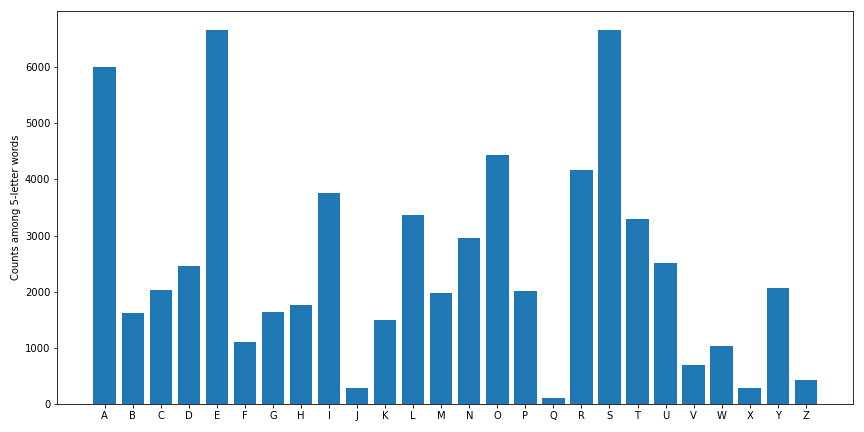

# Wordle-analysis

Some simple analysis to help me find a good initial guess in Wordle.

## Letter frequencies

First, a bar chart showing the occurences of each letter in 5-letter English words:

## Analysis of options for first guess

Then, a more detailed analysis of possible first guesses:
* First, make a list of all five-letter words
* Then, consider only first guesses that contain five of the nine most common letters
* Check those first guesses agains all other five-letter words
* Find the average number of correct letters
* Find the average number of correct letters in the correct place

## Results

The words **AEROS**, **AROSE**, and **SOARE** (all consisting of the five most common letters) can expect to find **2.15** correct letters on average, with AEROS being the best option as it has an expectation value of **0.63** correct letters in the correct place.

However, the word **TARES** does far better at finding correct letters in the correct place, with an expectation value of **0.81**, and only slightly lower expectation value for number of correct letters, at **2.06**.

### Table with a few more results

|  | Correct letters in correct place | Correct letters |
| :---: | :---: | :---: |
| AEROS | 0.63360 | 2.15179 |
| AESIR | 0.34312 | 2.09944 |
| ARISE | 0.36741 | 2.09944 |
| AROSE | 0.36294 | 2.15179 |
| LARES | 0.79579 | 2.06953 |
| RAISE | 0.46099 | 2.09944 |
| REAIS | 0.64215 | 2.09944 |
| SERAI | 0.44288 | 2.09944 |
| SOARE | 0.55026 | 2.15179 |
| TARES | 0.81414 | 2.06368 |
| TORES | 0.80126 | 1.94403 |
